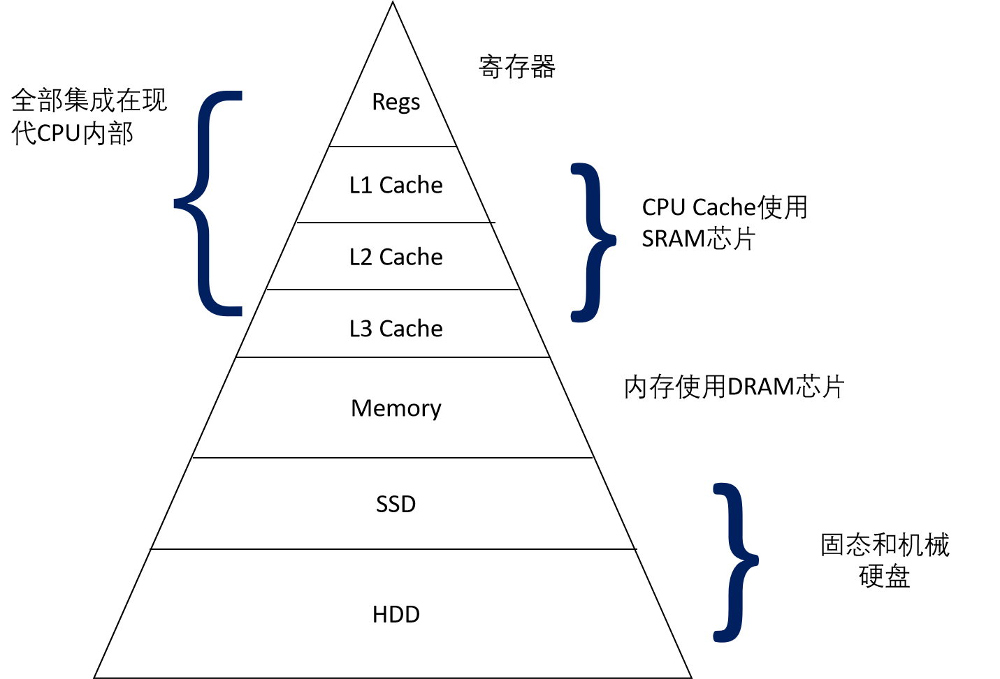

# PA1开辟天地的篇章。最简单的计算机
## 开天辟地的篇章
### 计算机可以没有寄存器吗? 
一下为本人的观点，可能不严谨。首先说结论一台计算机可以没有寄存器。  
还记得再计算机组成原理中，计算机的存储体系为一个金字塔结构，越在顶端的存储结构造价越贵，容量越小，速度越快，越王下走造价越便宜，容量越大，但是速度就会慢下来。之所以采用这种多层次的结构就是为了再速度和成本之间达到一个平衡。所以当有一种完美的存储器存在时，能够满足造价速度容量都是最优时，直接可以用这种存储器代替所有不同结构的存储器，寄存器也没有存在的必要了。所以把寄存器去掉计算机还可以运行，只需要在存储器上开辟一段专用空间用来保存寄存器的数值。
  
  
一下为google bard 给我的关于编程模型的相关内容
```
SA 中的编程模型是指 ISA 中规定的程序员如何编写程序的规则。它包括程序的结构、变量的类型和范围、运算符的优先级等。

ISA 中的编程模型可以分为两种：

指令集编程模型：这种模型将程序表示为一系列指令的序列。程序员需要了解指令的格式和含义，才能编写程序。
高级编程语言：这种模型将程序表示为高级语言的代码。程序员可以使用高级语言的语法和语义来编写程序。
指令集编程模型是 ISA 中最基本的编程模型。它可以直接在硬件上执行，效率最高。但是，指令集编程模型的难度较高，程序员需要了解大量的硬件细节。

高级编程语言是 ISA 中最常用的编程模型。它可以简化程序员的工作，提高程序的开发效率。但是，高级编程语言的效率较低，需要经过编译器转换成指令集编程模型才能在硬件上执行。

ISA 中的编程模型是程序员编写程序的基础。程序员需要了解 ISA 中的编程模型，才能编写出正确、高效的程序。
```
## RTSC
### 究竟要执行多久
在cmd_c()函数中, 调用cpu_exec()的时候传入了参数-1, 你知道这是什么意思吗?
```
由于尽管传入的是-1,但是在cpu的内部是以补码的形式存放这个数字，所以-1对应的补码表示为0xFFFFFFFFFFFFFFFF，并且在后面的执行中会将-1这个数值视为无符号数uint64_t,所以-1在此时表示为最大的无符号整数
```
### 优美的推出
当对nemu输入q进行退出时可以见到这个报错信息。根据下图所示的报错信息可以知道，这个报错信息是makefile产生的报错信息。
！[报错信息]()  
由于一个C/C++程序并不是main函数执行完毕后就结束，还要将返回值返回到操作系统，同时这个错误是在键入q退出的时候发生的，于是可以将目光集中到`main()` 函数的返回值上。

进入`is_exit_status_bad()`这个函数可以看到函数内部根据nemu的state来对返回值进行判断，起初最开始我是直接将`!good`改为 `good`,在运行nemu自带的景象时退出是不会报错的，但是将AM中的软件镜像载入到nemu中时则会出现错误。  
此时想起了在nemu中有一个`cmd_q`函数，则想到了是否要对函数进行完善。可以看到在nemu.state的相关代码中枚举了相关的状态。将代码修改如下就可以优雅的进行退出了。  
！[]()

## 基础设施简易调试器
### 实现单步执行，打印寄存器，扫描内存
在完成单步执行，打印寄存器，以及扫描内存之前。先来看看一条指令在nemu中是如何解析和执行的。

可以看到每次都是通过`rl_gets()`这个函数来取得每次在命令行中的字符串。然后通过`strtok()`这个函数来对输入的字符串进行操作，将输入的字符串分割为cmd以及arg。  


然后通过`strcmp`来在cmd_table中找到需要执行的函数。


根据单步执行，打印寄存器，扫描内存需要的的cmd，去完善cmd_table，并建立相关函数，完成后的如上图所示。

#### 单步执行
```c
static int cmd_si(char *args){
  char *arg = strtok(NULL,"");
  int i = 0;//

  if(arg == NULL){//if there not any number behind the "si",then only run it onece
    cpu_exec(1);
  }
  else {
    sscanf(arg,"%d",&i);
    for(;i > 0 ; i--){
      cpu_exec(1);
    }
  }
  return 0;
}

```
#### 打印寄存器
```c
static int cmd_info(char *args){
  char *arg = strtok(NULL," ");
  if(arg == NULL){
    printf("Please input parameter\n");
    printf("e.g. info r :Display the status of regisiters\n");
    printf("e.g. info w :Display the status of watch points\n");
    return 0;//
  }
  else {
    if(strcmp(arg,"r") == 0){
      isa_reg_display();
    }
    else if(strcmp(arg,"w") == 0){//show all the value of watchpoint
          print_wp();
    }
  }

  return 0;
}
```

#### 扫描内存
```C
static int cmd_x(char *args){
  char *num = strtok(NULL," ");
  char *addr = strtok(NULL," ");

  int lenth = 0;
  int addrNumber;
  int i,j = 0;

  sscanf(num,"%d",&lenth);
  sscanf(addr,"%x)",&addrNumber);

  if(addr == NULL){
    printf("Please input the number crrectlly");
    return 0;
  }
  for(i = 0;i < lenth ;i++){
    if(j % 4 == 0){
      printf("0x%x: ",addrNumber);
    }
    j++;
    printf("0x%8lx   ",vaddr_read(addrNumber,4));

    addrNumber = addrNumber + 4;

    if(j%4 == 0){
      printf("\n");
    }
  }
  return 0;
}

```
## 表达式求值
在nemu中`expr.c`中处理处理关于表达式求直的相关代码。其中函数`expr(arg,success)`传入需要的参数，以及是否成功的标志位。
### 实现算术表达式的词法分析
进入`expr(arg,srccess)`后使用`make_token()`来对输入的表达式字符串转化为一个一个token。
### printf输出为什么要换行
因为printf()运行的时候是先将输出的内容放入缓冲区当中，遇到换行符的时候才将缓冲区当中的内容进行输出，如钩没有换行符的话就只会往缓冲区中进行写入，而没有输出。
### 实现算术表达式的递归求直
在把输入的字符串转化为一个一个的token后，就通过`eval(p,q)`函数进行表达式求直，这里主要使用了递归的思想，由于代码太多了，一下子全部贴上来的话篇幅太长了，我就用伪代码来讲解以下思路
```C
uint32_t eval(int p,int q){
//p 为当前表达式的左下标， q 为表达式的右下标
  if(p>q){
    //左下标p 大于了右下标q 那么现在的表达式的求解有错误额
  }
  else if(p == q){//only numbers can be here
    //当左右下标相等的时候则此时位置上的为操作数
    //操作数可为十进制数，寄存器的直等
    //然后将取得的操作数通过 返回到递归的上一层

    return result; //返回取得的操作数的直
  }

  else if(checkparentheses(p,q)){
    //判断表达式的左右下标的地方是不是有一层括号包围
    //如果有括号包围那么就将括号去掉，在一次进行递归
      return eval(p+1,q-1); 
  }

  else {
    int OP;
    int result = 0;
    //根据运算的优先级判断在表达式中谁的优先级最低，将优先级最低的那个符号位置设置为OP
    OP = dominant_operator(p,q); 
    int val1;
    //在OP的左右两边又把表达式子分成左右两个部分，然后分别进行递归运算。
    if(tokens[OP].type == NEG || tokens[OP].type == POINTER){
         val1 = 0;
    }
    else {
         val1 = eval(p,OP - 1);
    }
    int val2 = eval(OP + 1,q);

//根据OP 来对返回的数值进行运算，运算完毕后又返回递归上一级，直到运算结束。
    switch (tokens[OP].type)
    {
      case TK_EQ:
        return val1 == val2;
      break;
      case TK_NEQ:
        return val1 != val2;
      break;
      case AND:
        return val1 && val2;
      break;
      case OR:
        return val1 || val2;
      case NEG:
        return -val2;
      break;
      case POINTER:
        return vaddr_read(val2,4);
      break;
      case '+':
        return val1 + val2;
      break;
      case '-':
        return (val1 - val2);
      break;
      case '*':
        return (val1 * val2);
      break;
      case '/':
         if(val2 == 0){
           return 1;
         }
         else{
          return (val1 / val2);
         }
      break;
    
    default:
      //assert(0);
      break;
    }
  }
}
```
## 监视点
对于监视点的整体实现思路
1. 定义一个相应的数据结构，能够存放监视点的表达式，以及监视点的old alue
```c
typedef struct watchpoint {
  int NO;
  struct watchpoint *next; //下一个监视点的地址
  char expr[128];//存放输入的表达式
  int val;//当前的数值
  int old_val;//上一个数值
  bool changed;//数值是否有变化
} WP;
```
2. 定义一个监视点池，对监视点进行管理。
```c
static WP wp_pool[NR_WP] = {}; //定义NR_WP个监视点
static WP *head;
static WP *free_;//空闲的WatchPoint
```
构建以下函数对监视点进行管理
```C
//初始化监视点池
void init_wp_pool() {
  int i;
  for (i = 0; i < NR_WP; i ++) {
    wp_pool[i].NO = i;
    wp_pool[i].next = (i == NR_WP - 1 ? NULL : &wp_pool[i + 1]);
  }
  head = NULL;
  free_ = wp_pool;
}
```
```c
//从空闲的监视点池中获取一个监视点
WP* new_wp(){//get a new watchpointe node

  WP* WP_buf;
  if(free_ == NULL){
    printf("there no avaliable watchpoint\n");
    return NULL;
  }
  else {
    WP_buf = free_;
    free_ = free_->next;
  }

  return WP_buf;
}
```

```c
//将取得的监视点加入使用的链表中
void addWPHead(WP* addWP){
    addWP->next = head;
    head = addWP;
}
```

```c
//删除head中的链表
void deleteWP(int n){
  WP* WP_buf;
  WP_buf = head;
  if(n<32 && n >=0){

    while(WP_buf->NO != n){
      WP_buf = WP_buf->next;
    }
    free_wp(WP_buf);
  }

  else{
    printf("Please input the right number\n");
  }
}
```

```c
//释放一使用的链表重新将其放入free的监视点池中
void free_wp(WP *wp){
  WP* head_buf = head;
  if(head_buf == NULL)
  {
    printf("There no watchpoints are in use\n");
  }
  else{
    if(head_buf == wp){
      head = wp->next;
      wp->next = free_;
      free_ = wp;
    }
    else {
      while(head_buf->next != wp && head_buf->next != NULL){
        head_buf = head_buf->next;
    }
    WP* buffer;
      if(head_buf->next == NULL){
        printf("there is no such a watchpoint\n");
      }
      else {
        buffer = head_buf->next->next;
        head_buf->next->next = free_;
        free_ = head_buf->next;
        head_buf->next = buffer;
      }
    }
  }
}
```

3. nemu运行的时候，一条指令执行完毕后，则对监视点中的表达式再一次进行求直，如果表达式求直新的直如果与old_value不相等则把nemu.state 的状态设置为stop。  
```c
//将这一条代码放入cpu_exec中
  if(check_wp() == true){ //如果check_wp为true则停止运行
    nemu_state.state = NEMU_STOP;
  }
```

```c
// 检查WP中的表达式是否发生了改变
bool check_wp(){
  WP* head_buf;
  head_buf = head;
  int success;
  bool  change;
  change = false;
  while(head_buf != NULL){
    head_buf->val = expr(head_buf->expr,&success);
    if(head_buf->old_val != head_buf->val){
      head_buf->changed = 1;
      head_buf->old_val = head_buf->val;
      printf("watchpoint changed: NO.%d   expr:%s   val:%d\n",head_buf->NO,head_buf->expr,head_buf->val);
      change = true;
    }
    else{
      head_buf->changed = 0;
      change = false;
    }
    head_buf = head_buf->next;
  }
  return change;
}
```
